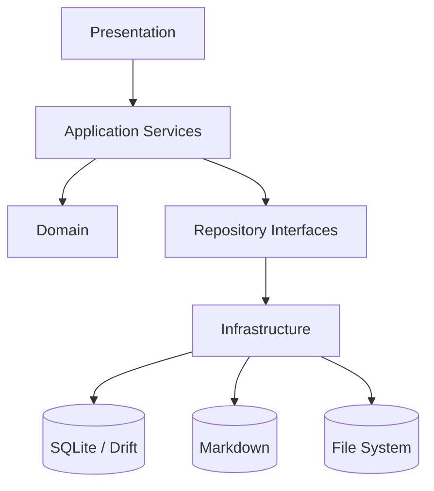

# Personal Workbench V1 — Flutter 技术架构

## 1. 当前代码基线

当前仓库：`dadalili2019/cloud_disk`，默认分支 `main`。

工程已经使用 Flutter Desktop，主要依赖包括：

```text
flutter
fluent_ui
go_router
bitsdojo_window
system_tray
path_provider
sqflite
sqflite_common_ffi
shared_preferences
```

因此 Personal Workbench 不重新建工程。

## 2. 当前已有可复用能力

- `NavigationPage / NavigationView / NavigationPane`：演进为 Workbench AppShell。
- `go_router / ShellRoute / NoTransitionPage / DeferredWidget`：继续复用。
- `ThemeController extends ChangeNotifier / ThemeScope / SharedPreferences / Palette`：继续复用。
- `bitsdojo_window / Window Buttons / System Tray`：继续保留。

## 3. 当前需要逐步改善的地方

当前 Todo 页面同时负责 UI、SQLite 初始化、读取、写入和关闭数据库。Personal Workbench 新模块禁止继续复制这种模式。

目标：

```text
UI
↓
Application Service
↓
Repository
↓
SQLite / Markdown
```

现有 `DBHelper + my_database.db` 标记为 Legacy，继续服务旧功能。

## 4. 目标技术栈

```text
Dart
Flutter
fluent_ui
go_router
Windows Desktop First
Mobile Later
```

新 Workbench 数据层建议 `Drift + SQLite`，正文使用 Markdown + Local File System。

## 5. 数据库迁移策略

```text
Legacy
my_database.db
└─ Todo / 原有工具数据

New
workbench.db
└─ Workspace / Task / Note / Issue / ...
```

第一阶段不直接破坏旧数据库。旧 Todo 后续如需保留，通过一次性 Import / Migration 转成 Task。

## 6. 目标分层



## 7. 推荐新模块目录

```text
lib/
app/
  router/
  theme/
  bootstrap/

core/
  database/
  filesystem/
  result/
  id/
  logging/

features/
  home/
  workspace/
  task/
  note/
  issue/
  resource/
  decision/
  knowledge/
  time/
  developer/
  tools/
  settings/
  ai/
```

旧 `pages / dto / utils / services` 不要求一次迁移。

## 8. State Management

当前没有引入 Bloc / Riverpod / Provider / GetX。可见的全局状态模式主要是 `ChangeNotifier + AnimatedBuilder`，页面大量使用 StatefulWidget / setState。

V1 不强制增加新状态管理框架。推荐：

```text
Page
↓
Controller / ChangeNotifier
↓
Application Service
```

## 9. Routing

继续使用 GoRouter + ShellRoute。目标路由：

```text
/home
/workspace/:workspaceId/overview
/workspace/:workspaceId/tasks
/workspace/:workspaceId/notes
/workspace/:workspaceId/issues
/workspace/:workspaceId/resources
/workspace/:workspaceId/more
/time
/knowledge
/developer
/tools
/settings
```

Global AI 默认作为 AppShell Right Drawer，不需要独立主路由。

## 10. Workspace Shell

```text
AppShell
└─ WorkspaceShell
   └─ Page
```

WorkspaceShell 负责 Header / Tabs / Child Route。

## 11. Application Services

最终方向：

```text
HomeService
WorkspaceService
WorkspaceOverviewService
TaskService
NoteService
IssueService
ResourceService
DecisionService
KnowledgeService
EntityLinkService
TimeService
ActivityService
SearchService
DeveloperService
AIService
AIContextBuilder
SettingsService
BackupService
```

Phase 1 只实现必要部分。

## 12. Markdown Note 保存

```text
Text Change
→ debounce 500ms
→ NoteService
→ temp file
→ flush
→ atomic rename
→ update SQLite metadata
→ Saved
```

## 13. App Paths

统一由 `AppPaths` 管理 workbenchRoot / database / workspaceNotes / knowledge / attachments / backups / exports。

## 14. 性能约束

禁止：build() 中 I/O、页面切换扫描全部文件、UI isolate 大量 SQLite 工作、全局 setState、大文件同步读取、Markdown 每字符写盘。

应该：Database background execution、Markdown debounce、局部刷新、List virtualization、Search 增量索引、Overview Snapshot/Cache。

## 15. Phase 1

```text
Workbench App Shell
Workbench Router
workbench.db + Migration
Workspace
Task
Current Task
Markdown Note
Entity Link
Activity
Workspace Overview
```

## 16. 第一阶段验收

创建 cloud_disk → 创建 Task “Flutter Windows 性能优化” → 设置 Current → 保存 Next Step → 创建 Markdown Note → Note linked_to Task → Overview 显示 Current Task / Next Step / Linked Note → 关闭应用 → 重新打开仍能恢复。

## 17. 与现有代码关系

复用 Shell / Theme / Router / Desktop 能力；新增 Workbench Domain / Application / Repository / workbench.db / Markdown Storage。不是推倒重写 cloud_disk。
