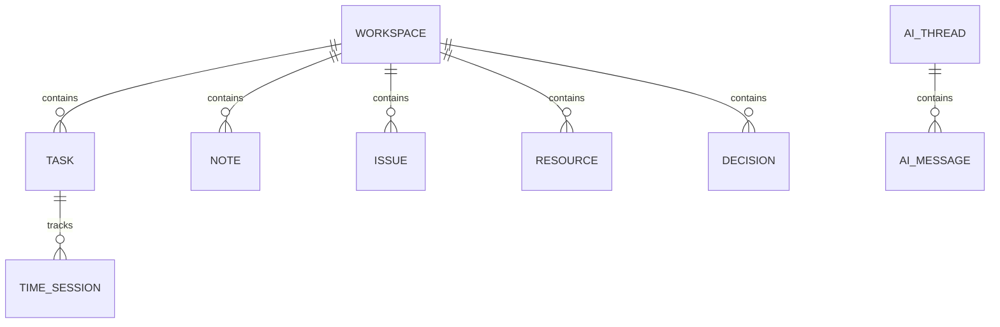
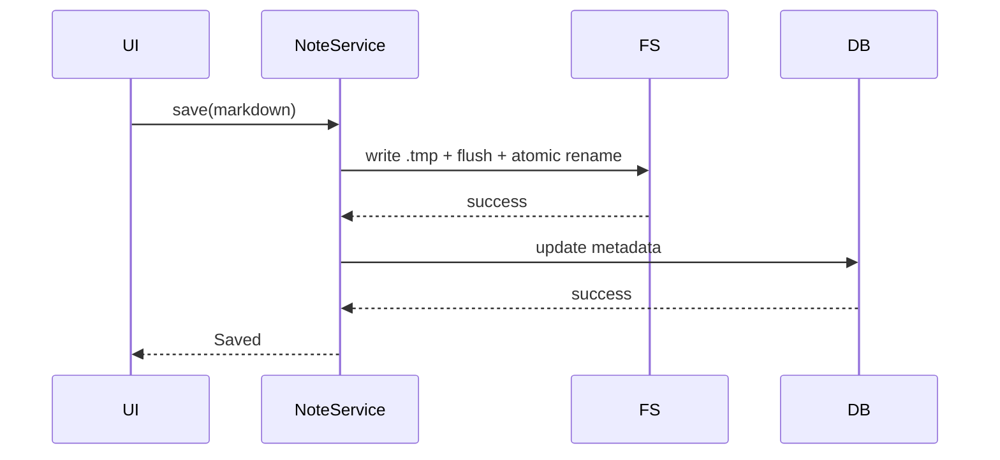

# Personal Workbench V1 — 数据模型与存储设计

## 1. 存储原则

```text
SQLite = 结构化数据、状态、关系、时间、设置、AI 历史
Markdown = Notes / Knowledge 正文
File System = 附件、导入文件、备份
```

## 2. Source of Truth

| 数据 | Source of Truth |
|---|---|
| Workspace / Task / Issue / Resource / Decision | SQLite |
| Note Metadata | SQLite |
| Note Body | Markdown |
| Knowledge Metadata | SQLite |
| Knowledge Body | Markdown |
| Entity Links / Time / AI / Settings | SQLite |
| Attachments | File System |

## 3. 目录结构

```text
PersonalWorkbench/
data/workbench.db
workspaces/cloud_disk/notes/*.md
workspaces/cloud_disk/attachments/
knowledge/*.md
attachments/
backups/
exports/
```

数据库保存相对路径。

## 4. 核心实体

```text
Workspace
Task
Note
Issue
Resource
Decision
Knowledge
EntityLink
TimeSession
ActivityEvent
DeveloperAsset
AIThread
AIMessage
Tag
Attachment
AppSetting
```

## 5. 关系



## 6. Task

核心字段：`title / status / progress / next_step / is_current`。每个 Workspace 最多一个 `is_current=1`。

## 7. Note

SQLite 只保存 metadata 和 `file_path`，正文保存 `.md`。

## 8. Issue

核心：`status / severity / impact / hypothesis / next_investigation_step / resolution`。

## 9. Resource

类型：`repository / local_path / document / service / link / design / command / other`。

## 10. Decision

保存：`Decision / Why / Revisit Condition`。

## 11. Knowledge

Metadata 存 SQLite，正文 `.md`。通过 `entity_link: derived_from` 保存 Note / Decision / Issue 来源。

## 12. Entity Link

统一关系表：

```text
Note       linked_to     Task
Issue      blocks        Task
Resource   supports      Task
Decision   applies_to    Task
Knowledge  derived_from  Note
```

不建立多套重复关系表。

## 13. Work Context

```text
TaskContext
├─ task
├─ notes[]
├─ issues[]
├─ resources[]
├─ decisions[]
├─ knowledge[]
└─ recentActivity[]
```

Home、Overview、Continue、AI 复用这一对象。

## 14. AI Context

Scope：`task / workspace / knowledge / global`。

优先级：Current Task / Next Step / Active Blocker → Recent Note / Decision → Resource → Knowledge。

## 15. Time / ID / Delete

- 时间统一 UTC ISO-8601。
- 核心 ID 使用 UUID。
- 默认 Archive / Soft Delete。

## 16. Markdown 保存



## 17. Legacy 数据

当前 `my_database.db + DBHelper + Legacy Todo` 继续保留。Personal Workbench 使用独立 `workbench.db`，后续可单独做 Todo → Task Import。
